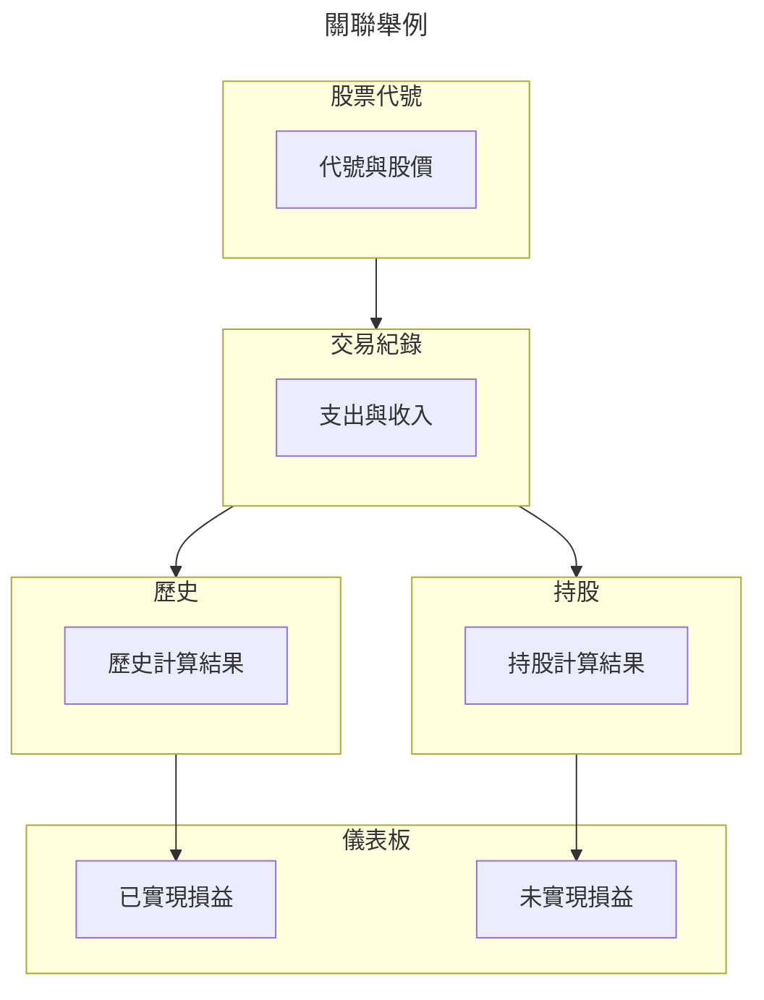

在 _台股訂閱版_ 有許多的分頁，這裡依照這些功能頁面分別介紹

- [儀表板](/guide/sheets/儀表板.md)
- [交易紀錄](/guide/sheets/交易紀錄.md)
- [現金股利](/guide/sheets/現金股利.md)
- [觀察](/guide/sheets/觀察.md)
- [持股與歷史](/guide/sheets/持股與歷史.md)
- [統計](/guide/sheets/統計.md)
- [券商與分類](/guide/sheets/券商與分類.md)
- [股票代號](/guide/sheets/股票代號.md)
- [自動記錄](/guide/sheets/自動記錄.md)
- [融資券](/guide/sheets/融資券.md)

雖然這些頁面是分開的，但其實不少頁面彼此是相互關聯的
其中儀表板是最複雜的，資料源來自多個分頁

